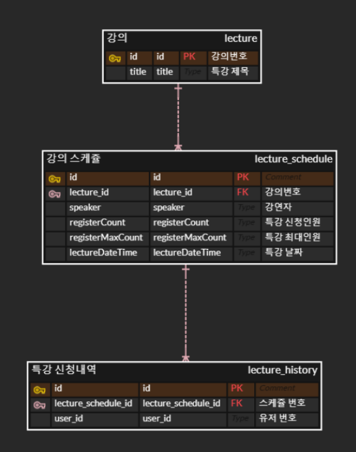

# [ 2주차 과제 ] 특강 신청 서비스

<aside>
💡 아래 명세를 잘 읽어보고, 서버를 구현합니다.

</aside>

## Description

- `특강 신청 서비스`를 구현해 봅니다.
- 항해 플러스 토요일 특강을 신청할 수 있는 서비스를 개발합니다.
- 특강 신청 및 신청자 목록 관리를 RDBMS를 이용해 관리할 방법을 고민합니다.

## Requirements

- 아래 2가지 API 를 구현합니다.
    - 특강 신청 API
    - 특강 신청 여부 조회 API
- 각 기능 및 제약 사항에 대해 단위 테스트를 반드시 하나 이상 작성하도록 합니다.
- 다수의 인스턴스로 어플리케이션이 동작하더라도 기능에 문제가 없도록 작성하도록 합니다.
- 동시성 이슈를 고려 하여 구현합니다.

## API Specs

1️⃣ **(핵심)** 특강 신청 **API**

- 특정 userId 로 선착순으로 제공되는 특강을 신청하는 API 를 작성합니다.
- 동일한 신청자는 동일한 강의에 대해서 한 번의 수강 신청만 성공할 수 있습니다.
- 특강은 선착순 30명만 신청 가능합니다.
- 이미 신청자가 30명이 초과 되면 이후 신청자는 요청을 실패합니다.

**2️⃣ 특강 선택 API**

- 날짜별로 현재 신청 가능한 특강 목록을 조회하는 API 를 작성합니다.
- 특강의 정원은 30명으로 고정이며, 사용자는 각 특강에 신청하기 전 목록을 조회해 볼 수 있어야 합니다.

3️⃣  ****특강 신청 완료 목록 조회 API

- 특정 userId 로 신청 완료된 특강 목록을 조회하는 API 를 작성합니다.
- 각 항목은 특강 ID 및 이름, 강연자 정보를 담고 있어야 합니다.

<aside>
💡 **KEY POINT**

</aside>

- 정확하게 30 명의 사용자에게만 특강을 제공할 방법을 고민해 봅니다.
- 같은 사용자에게 여러 번의 특강 슬롯이 제공되지 않도록 제한할 방법을 고민해 봅니다.

````sh
├─main
│  ├─java
│  │  └─com
│  │      └─example
│  │          └─hhplus2weeks
│  │              │  LectureApplication.java
│  │              │  
│  │              ├─api
│  │              │  │  LectureController.java
│  │              │  │  
│  │              │  └─dto
│  │              │     ApplyRequest.java
│  │              │     LectureHistoryResponse.java
│  │              │          
│  │              ├─domain
│  │              │  └─lecture
│  │              │      │  Lecture.java
│  │              │      │  LectureHistory.java
│  │              │      │  LectureSchedule.java
│  │              │      │  
│  │              │      ├─exception
│  │              │      │      CapacityExceededException.java
│  │              │      │      DuplicateRequestsException.java
│  │              │      │      
│  │              │      ├─repository
│  │              │      │      LectureHistoryRepository.java
│  │              │      │      LectureRepository.java
│  │              │      │      LectureScheduleRepository.java
│  │              │      │      
│  │              │      └─service
│  │              │              LectureApplyValid.java
│  │              │              LectureService.java
│  │              │              
│  │              ├─global
│  │              │  ├─config
│  │              │  └─error
│  │              │     ErrorResponse.java
│  │              │     GlobalExceptionHandler.java
│  │              │          
│  │              └─infrastructure
│  │                  │  LectureHistoryJpaRepository.java
│  │                  │  LectureHistoryRepositoryImpl.java
│  │                  │  LectureJpaRepository.java
│  │                  │  LectureRepositoryImpl.java
│  │                  │  LectureScheduleJpaRepository.java
│  │                  │  LectureScheduleRepositoryImpl.java
│  │                  │  
│  │                  ├─entity
│  │                  │  BaseEntity.java
│  │                  │  LectureEntity.java
│  │                  │  LectureHistoryEntity.java
│  │                  │  LectureScheduleEntity.java
│  │                  │      
│  │                  └─mapper
│  │                     LectureHistoryMapper.java
│  │                     LectureMapper.java
│  │                     LectureScheduleMapper.java
│  │                          
│  └─resources
│      application.properties
│      data.sql
│          
└─test
    └─java
        └─com
            └─example
                └─hhplus2weeks
                    │  LectureApplicationTests.java
                    │  
                    └─domain
                        └─lecture
                            └─service
                               LectureServiceIntegrationTest.java
                               LectureServiceTest.java                                
````



